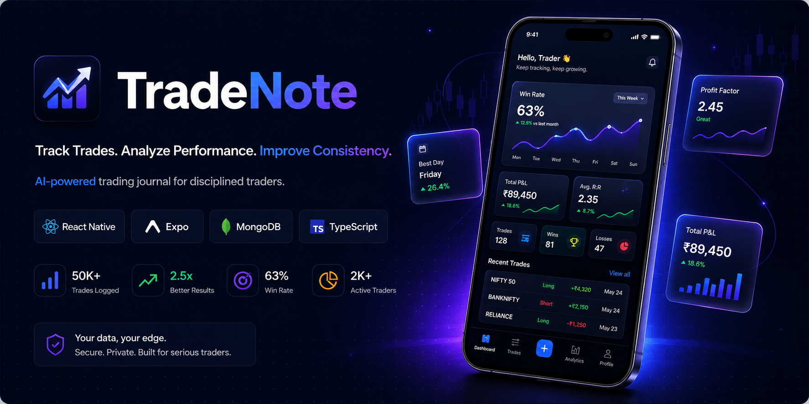

<div align="center">
  

  # 📈 Trade Note - Advanced Trading Journal

  **A comprehensive, mobile-first trading journal application built to help traders analyze, track, and improve their trading performance.**

  [](https://reactnative.dev/)
  [](https://expo.dev/)
  [](https://www.typescriptlang.org/)
  [](https://tailwindcss.com/)

</div>

<br />

## 🌟 About The Project

**Trade Note** is a meticulously crafted mobile application designed for active traders across various asset classes (Crypto, Forex, Stocks). It goes beyond simple PnL tracking by offering deep insights into trading habits, strategy effectiveness, and emotional discipline. 

Built with modern React Native architecture and a premium user interface, it provides a seamless experience for logging trades on the go, analyzing historical data, and managing risk through custom rules and checklists.

## ✨ Key Features

- **📊 Advanced Analytics Dashboard**: Real-time overview of your trading performance, win rate, and profitability metrics visualized with interactive charts.
- **📝 Comprehensive Trade Logging**: Quickly log trades with detailed parameters including entry/exit prices, stop loss, take profit, fees, and emotional state.
- **🧮 Smart PnL Engine**: Accurate calculation of Gross PnL, Net PnL, and ROI% factoring in leverage and asset class specifics.
- **🛡️ Risk Management & Rules**: Define and enforce custom trading rules and pre-trade checklists to maintain discipline.
- **🧠 Strategy & Mistake Tracking**: Tag trades with specific strategies and common mistakes to identify patterns and optimize your edge.
- **🔐 Secure Authentication**: Integrated with Clerk for robust and secure user authentication (including Google Sign-In).
- **📱 Fully Responsive UI**: Built with NativeWind (Tailwind CSS) for a consistently beautiful experience across all mobile devices.

## 🛠️ Tech Stack

This project leverages a cutting-edge frontend stack optimized for performance, maintainability, and rapid development:

- **Framework**: [React Native](https://reactnative.dev/) & [Expo](https://expo.dev/) (App Router)
- **Language**: [TypeScript](https://www.typescriptlang.org/) (Strict Mode)
- **Styling**: [NativeWind](https://www.nativewind.dev/) (Tailwind CSS for React Native) v4/v5
- **State Management**: [Zustand](https://zustand-demo.pmnd.rs/) (Client State) & [TanStack React Query](https://tanstack.com/query/latest) (Server State/Async Data)
- **Form Handling**: [React Hook Form](https://react-hook-form.com/) with [Zod](https://zod.dev/) validation
- **Authentication**: [Clerk](https://clerk.com/)
- **UI Components**: Custom tailored components, `@gorhom/bottom-sheet`, `react-native-chart-kit`
- **Animations**: `react-native-reanimated` & `react-native-gesture-handler`

## 📁 Project Architecture

The codebase follows a scalable, feature-first architecture to ensure clean separation of concerns:

```text
trade-note-mobile/frontend/
├── app/                  # Expo Router file-based navigation (Auth & App layouts)
├── assets/               # Static assets (images, fonts)
├── components/           # Reusable UI building blocks organized by feature
│   ├── addTrade/         # Trade logging specific components
│   ├── dashboard/        # Dashboard charts and widgets
│   ├── common/           # Shared generic UI (Buttons, Inputs, Cards)
│   └── ...
├── constants/            # App-wide constants, theme colors, config
├── hooks/                # Custom React hooks (logic reuse)
├── lib/                  # Utility functions, API clients, Sentry config
├── models/               # Data structures and domain models
├── services/             # External service integrations
├── store/                # Zustand state slices
├── types/                # TypeScript interfaces and global types
└── utils/                # Helper functions (PnL calculators, formatters)
```

## 🚀 Getting Started

To run this project locally, follow these steps:

### Prerequisites

- Node.js (v18 or newer recommended)
- npm or yarn
- Expo Go app on your physical device, or an iOS Simulator / Android Emulator installed.

### Installation

1. **Clone the repository** (if applicable):
   ```bash
   git clone <repository-url>
   cd trade-note-mobile/frontend
   ```

2. **Install dependencies**:
   ```bash
   npm install
   ```

3. **Environment Variables**:
   Create a `.env` or `.env.local` file in the root directory and add the necessary environment variables (e.g., Clerk Publishable Key).
   ```env
   EXPO_PUBLIC_CLERK_PUBLISHABLE_KEY=your_clerk_key
   EXPO_PUBLIC_CLERK_GOOGLE_WEB_CLIENT_ID=your_google_client_id
   ```

4. **Start the development server**:
   ```bash
   npx expo start
   ```

5. **Run the app**:
   - Press `a` to open in Android Emulator
   - Press `i` to open in iOS Simulator
   - Scan the QR code with the Expo Go app on your physical device.

## 📈 Future Roadmap

- Implement AI-driven trade summarization and insights.
- Export capabilities (CSV/PDF) for tax reporting.
- Advanced backtesting simulation module.
- Social sharing for trade setups.

---
*Designed & Developed with focus on clean code and robust architecture.*
